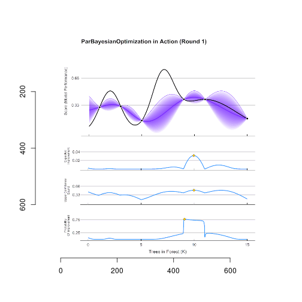
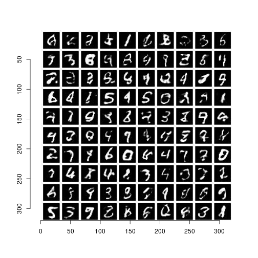

Probabilistische Funktionen
========================================================
author: Christoph Schmalhofer
date: 
autosize: true

Anwendung I: Optimierung
========================================================
- Wikipedia Bayesian Optimization (Gaußprozesse)
- für welchen Input ist der Erwartungswert maximal?

Anwendung II: Generatives Modell (VAE, Neuronale Netze)
========================================================

- Variational Autoencoder in Pyro
- eine probabilistische Funktion liefert Bilder

Universal Probabilistic Programming
========================================================

- Funktionale Programmierung

- Probabilistische Modelle

- Programm spezifiziert Wahrscheinlichkeitsverteilung

- Funktion berechnet Wahrscheinlichkeitsverteilung

- Denotationale Semantik

- Sampling (Monte Carlo) Semantik

Higher Order 
========================================================

- Wahrscheinlichkeitsverteilte Funktionen

- Funktionale Programmiertechniken

- Rekursion

- map/filter/reduce

- Monaden

- Haskell und R Demo: Sampling einer Funktion

Demo Higher Order
========================================================

- Bernoulli Random Walk in R

- Und jetzt in Julia

Gaußprozesse
========================================================

- Präsentation r_gauss_process
- einfache Gaußprozesse
- Kovarianzfunktionen

Julia Gaußprozesse
========================================================

- Keeling Curve - Mauna Loa
- Julia GaussianProcesses.jl
- Demo

